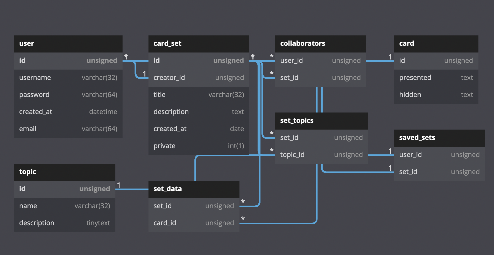

# Backend API Information
- Created with Node.js with Express framework using TypeScript
- Database: Relational Database using MySQL

### Note: authentication is incomplete, OAuth will be used for authentication but that will be implemented later..
## Database Diagram


Image generated from [dbdiagram.io]("https://dbdiagram.io")
## DBDiagram Code
```typescript
Table user {
  id unsigned [pk, increment]
  username varchar(32)
  password varchar(64)
  created_at datetime
  email varchar(64)
}

// Metadata of a set
Table card_set {
  id unsigned [pk, increment]
  creator_id unsigned [ref: < user.id]
  title varchar(32)
  description text
  created_at date
  private int(1) // this is a boolean
}

// A set can be collaborative
Table collaborators {
  user_id unsigned [ref: > user.id]
  set_id unsigned [ref: > card_set.id]
}

Table card {
  id unsigned
  presented text // Presented side text
  hidden text // Concealed (bottom) side text
}

Table topic {
  id unsigned [pk, increment]
  name varchar(32)
  description tinytext
}

// Junction Tables
Table set_data {
  set_id unsigned [ref: > card_set.id]
  card_id unsigned [ref: > card.id]
}


Table set_topics {
  set_id unsigned [ref: > card_set.id]
  topic_id unsigned [ref: > topic.id]
}

Table saved_sets {
  user_id unsigned [ref: - user.id]
  set_id unsigned [ref: < card_set.id]
}
```

```sql
CREATE TABLE user (id BIGINT UNSIGNED AUTO_INCREMENT, username varchar(32), password varchar(32), created_at DATETIME, email varchar(64), PRIMARY KEY(id));

INSERT INTO user (username, password, created_at, email) VALUES("defnotneal", "abcd123", NOW(), "my.email@mail.edu");

CREATE TABLE card_set (id BIGINT UNSIGNED AUTO_INCREMENT, title varchar(32), description TEXT, created_at DATETIME, private TINYINT(1), PRIMARY KEY(id), creator_id BIGINT);

ALTER TABLE card_set ADD CONSTRAINT FK_creator_id FOREIGN KEY (creator_id) REFERENCES user(id);

CREATE TABLE topic (id BIGINT UNSIGNED AUTO_INCREMENT, name VARCHAR(32), DESCRIPTION TINYTEXT, PRIMARY KEY(id));

CREATE TABLE card (id BIGINT UNSIGNED AUTO_INCREMENT, presented TINYTEXT, hidden TINYTEXT, PRIMARY KEY(id));

CREATE TABLE authors (
  author_id BIGINT UNSIGNED NOT NULL, 
  set_id BIGINT UNSIGNED NOT NULL, 
  CONSTRAINT PK_authors PRIMARY KEY (
    author_id,
    set_id
  ),
  FOREIGN KEY (author_id) REFERENCES user (id),
  FOREIGN KEY (set_id) REFERENCES card_set (id)
)

CREATE TABLE saved_sets (
  user_id BIGINT UNSIGNED NOT NULL,
  set_id BIGINT UNSIGNED NOT NULL,
  CONSTRAINT PK_saved_sets PRIMARY KEY(
    user_id,
    set_id
  ),
  FOREIGN KEY (user_id) REFERENCES user (id),
  FOREIGN KEY (set_id) REFERENCES card_set (id)
);

CREATE TABLE set_data (
  set_id BIGINT UNSIGNED NOT NULL,
  card_id BIGINT UNSIGNED NOT NULL,
  CONSTRAINT PK_set_data PRIMARY KEY(
    set_id,
    card_id
  ),
  FOREIGN KEY (set_id) REFERENCES card_set (id),
  FOREIGN KEY (card_id) REFERENCES card (id)
);


CREATE TABLE set_topics (
  set_id BIGINT UNSIGNED NOT NULL,
  topic_id BIGINT UNSIGNED NOT NULL,
  CONSTRAINT PK_set_topics PRIMARY KEY(
    set_id,
    topic_id
  ),
  FOREIGN KEY (set_id) REFERENCES card_set (id),
  FOREIGN KEY (topic_id) REFERENCES topic (id)
);
```


### Endpoints (an incomplete list):
POST /auth/login \
POST /auth/register \

GET /card/:id
